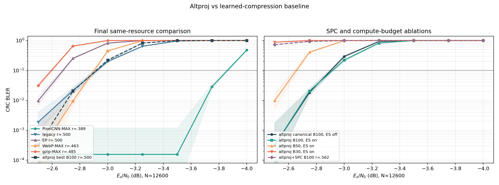

# AltProj compression baseline 격차 해소 실험 보고서

> **CRC 정정 상태:** 이 보고서의 CRC-BLER 수치는 soft-logit CRC 오용으로
> primary 근거에서 제외한다. hard-CRC budget-100/50/30/20 대체 결과는
> [`HARD_CRC_REMEASUREMENT_REPORT_KO.md`](HARD_CRC_REMEASUREMENT_REPORT_KO.md)에
> 있고, 아래 수치는 역사적 부록으로만 보존한다.

## 최종 판정

목표였던 PixelCNN-MAX 역전에는 실패했다.

- 과거 기준: legacy knee `-2.86 dB`, PixelCNN-MAX `-3.79 dB`, 격차 `0.93 dB`
- 지정 canonical AltProj(`δ=0.02`, `ρ=0.9`, `[5]×20`, `σ: 0.3→0.02`, CRC early-stop off): knee `-2.824 dB`, 격차 `0.966 dB`
- 이번 탐색의 최선 AltProj(`[5]×20`, `σ: 0.3→0.05`, CRC early-stop on): knee `-2.850 dB`, 격차 `0.940 dB`
- AltProj+SPC: 측정 격자의 가장 좋은 점인 `-2.5 dB`에서도 BLER `0.726`; knee는 `>-2.5 dB`
- 예산 50 best: knee `-2.557 dB`; 예산 30 best: `-2.5 dB`에서도 BLER `0.876`

따라서 기존 `0.93 dB` 격차를 메우지 못했고, 최선 AltProj도 legacy보다 약 `0.010 dB` 뒤졌다. 다만 최선 AltProj는 WebP-MAX보다 약 `0.05 dB`, gzip-MAX보다 약 `0.32 dB` 앞선다.

모든 결과는 BPSK/AWGN/perfect CSI, payload `6272 bit`, `N=12600`, 동일 Es/N0와 동일 총 전송 에너지 기준이다. knee는 과거 compression baseline과 똑같이 인접 격자점의 **BLER에 대한 선형 보간**으로 계산했다.

## 선행 커밋

직전 fair-sigma/fading 결과는 본 작업을 시작하기 전에 다음 커밋으로 분리해 `origin/practical_sigma`에 push했다.

- `c6a7b48 experiments: fair sigma schedules and reevaluate fading`

이 보고서 이하의 SPC·waterfall·예산 축소 결과는 요청에 따라 아직 커밋하지 않았다.

## 1. 지정 canonical AltProj waterfall

구성:

- payload `6272` + CRC24A `24` = LDPC `k=6296`
- `n=12600`, payload rate `0.49778`, LDPC rate `0.49968`
- AltProj `δ=0.02`, `ρ=0.9`
- BP `[5]×20`, 명목 예산 `100`
- denoiser call 19회, geometric `σ: 0.3→0.02`, `sigma_post=3.0`
- CRC early-stop off

| Es/N0 (dB) | 실패/블록 | BLER | Wilson 95% CI |
|---:|---:|---:|---:|
| -2.50 | 1/3200 | 0.000313 | [0.000055, 0.001768] |
| -2.75 | 58/3200 | 0.018125 | [0.014047, 0.023358] |
| -3.00 | 300/1024 | 0.292969 | [0.265908, 0.321578] |
| -3.25 | 953/1024 | 0.930664 | [0.913441, 0.944668] |
| -3.50 | 1024/1024 | 1.000000 | [0.996262, 1.000000] |
| -3.75 | 1024/1024 | 1.000000 | [0.996262, 1.000000] |
| -4.00 | 1024/1024 | 1.000000 | [0.996262, 1.000000] |

knee @ BLER 0.1은 `-2.824 dB`, PixelCNN-MAX까지의 잔여 격차는 `0.966 dB`다. 지정 canonical AltProj 자체는 과거 legacy `-2.86 dB`를 넘지 못했다.

## 2. SPC 통합

### 2.1 실현성 및 인터페이스 결정

별도 모듈 `ldpc_altproj_spc.py`로 구현했다. production `decoder.py`는 수정하지 않았다.

차원과 rate:

| 구간 | bit 수 |
|---|---:|
| 원 payload | 6272 = 784×8 |
| 픽셀별 SPC 포함 | 7056 = 784×9 |
| CRC24A 포함 LDPC 입력 | 7080 |
| LDPC 출력 | 12600 |

- Sionna `LDPC5GEncoder(k=7080, n=12600)` 생성과 encode/decode가 실제로 동작했다.
- LDPC rate는 `0.56190`으로 상승하지만 payload rate는 계속 `6272/12600 = 0.49778`이다.
- payload는 raster 순서, 픽셀 안에서는 MSB-first 8비트다.
- LLR은 전 경로에서 `log P(bit=1) / P(bit=0)`이다.
- 각 픽셀에 systematic 8비트 뒤 XOR parity 1비트를 둔다.
- SPC parity도 source factor가 직접 관측하는 변수이므로 source correction `C`에 포함했다. 이를 제외하면 256-way 결합 factor가 parity 증거를 LDPC로 되돌릴 수 없다.
- CRC24A 24비트에는 source 모델이 없으므로 source extrinsic을 정확히 0으로 유지했다.
- source step은 `score prior × SPC parity likelihood`를 256개 픽셀 값에 대해 exact logsumexp로 marginalize하고, systematic 8비트와 parity 1비트의 posterior에서 입력 cavity를 빼 `D_t`를 만든다.
- AltProj 갱신은 `C_(t+1)=ρ C_t+δ D_t`, LDPC intrinsic은 `L_ch+C_t`다.

### 2.2 정확성 검증

| 검증 | 결과 |
|---|---|
| 0..255 전수 SPC XOR | 256/256 valid |
| byte↔MSB-first bits round-trip | exact |
| 256-way SISO vs 독립 brute-force | max LLR 오차 `3.28e-7` |
| 무잡음 payload recovery | 8/8 exact |
| 무잡음 CRC24A | 8/8 pass |
| 무잡음 SPC | 8/8 전체 valid |
| `δ=0` vs pure BP-100 | hard mismatch 0, max logit 차이 0 |

RTX 4080, batch 32에서 `[5]×20` 전체 decode는 약 `1.97 s`, 즉 `0.0615 s/block`이었다. 마지막 source call은 약 `8.4 ms`; 한 batch의 256-candidate 평가 수는 `122,028,032`다. 계산량은 크지만 GPU vectorization으로 실험 불가능한 수준은 아니었고, 이 측정에서는 BP가 지배적이었다.

### 2.3 소규모 재튜닝

`-2.7 dB`, paired 256 block에서 먼저 기존 `δ=0.02, ρ=0.9`로 `σ_end∈{0.05,0.02,0.01}`을 확인했으나 모두 `256/256` 실패해 이 축만으로는 구분할 수 없었다.

| δ | ρ | σ_end | 실패/256 | BLER | Wilson 95% CI |
|---:|---:|---:|---:|---:|---:|
| 0.02 | 0.90 | 0.02 | 256 | 1.0000 | [0.9852, 1.0000] |
| 0.02 | 0.95 | 0.02 | 256 | 1.0000 | [0.9852, 1.0000] |
| 0.05 | 0.90 | 0.02 | 227 | 0.8867 | [0.8420, 0.9200] |
| 0.05 | 0.95 | 0.02 | 236 | 0.9219 | [0.8824, 0.9489] |

`δ=0.05, ρ=0.9`를 고른 뒤 sigma endpoint를 다시 확인했다.

| σ_end | 실패/256 | BLER | Wilson 95% CI | `0.02` 대비 깨짐/구제 |
|---:|---:|---:|---:|---:|
| 0.05 | 232 | 0.9063 | [0.8643, 0.9362] | 5/0 |
| 0.02 | 227 | 0.8867 | [0.8420, 0.9200] | 기준 |
| 0.01 | 227 | 0.8867 | [0.8420, 0.9200] | 1/1 |

동률이면 기존 endpoint와 더 긴 유효 교정 구간을 보존하는 `0.02`를 택했다. 최종 SPC 구성은 `δ=0.05, ρ=0.9, σ:0.3→0.02`다.

### 2.4 SPC waterfall

| Es/N0 (dB) | 실패/블록 | BLER | Wilson 95% CI |
|---:|---:|---:|---:|
| -2.50 | 743/1024 | 0.725586 | [0.697450, 0.752036] |
| -2.75 | 953/1024 | 0.930664 | [0.913441, 0.944668] |
| -3.00 | 1018/1024 | 0.994141 | [0.987276, 0.997312] |
| -3.25 | 1024/1024 | 1.000000 | [0.996262, 1.000000] |
| -3.50 | 1024/1024 | 1.000000 | [0.996262, 1.000000] |
| -3.75 | 1024/1024 | 1.000000 | [0.996262, 1.000000] |
| -4.00 | 1024/1024 | 1.000000 | [0.996262, 1.000000] |

측정 범위 안에 BLER 0.1 교차점이 없다. 따라서 knee는 `>-2.5 dB`, PixelCNN-MAX 격차는 `>1.29 dB`다.

**판정:** SPC는 rate 비용을 갚지 못했다. exact 256-way 결합은 구현·수치 검증을 모두 통과했지만, `k=7080`으로 LDPC rate가 `0.4997→0.5619`로 상승하면서 채널 코드가 약해진 손실이 source 결합 이득보다 훨씬 컸다. 이 조건에서는 “per-bit 인터페이스를 넘는 correlated source factor”의 positive evidence가 아니다.

## 3. BP 예산 축소

### 3.1 예산×BP chunk×sigma endpoint 스크리닝

`-2.825 dB`, paired 512 block, `δ=0.02`, `ρ=0.9`, CRC early-stop on에서 모든 예산/스케줄마다 `σ_end∈{0.05,0.02,0.01}`을 다시 탐색했다. 실제 iteration은 codeword가 처음 CRC를 통과한 누적 BP iteration이며, 끝까지 실패하면 명목 예산이다.

| 명목 예산 | BP 스케줄 | σ_end | BLER (실패/512) | Wilson 95% CI | 평균 실제 BP iters |
|---:|---:|---:|---:|---:|---:|
| 100 | `[5]×20` | 0.05 | **0.0313 (16)** | [0.0193, 0.0502] | 58.28 |
| 100 | `[5]×20` | 0.02 | 0.0352 (18) | [0.0224, 0.0549] | 58.79 |
| 100 | `[5]×20` | 0.01 | 0.0625 (32) | [0.0446, 0.0869] | 60.50 |
| 100 | `[10]×10` | 0.05 | **0.1934 (99)** | [0.1615, 0.2298] | 82.21 |
| 100 | `[10]×10` | 0.02 | 0.3164 (162) | [0.2776, 0.3579] | 84.79 |
| 100 | `[10]×10` | 0.01 | 0.4531 (232) | [0.4105, 0.4964] | 86.99 |
| 50 | `[5]×10` | 0.05 | **0.6621 (339)** | [0.6201, 0.7017] | 49.16 |
| 50 | `[5]×10` | 0.02 | 0.7813 (400) | [0.7434, 0.8149] | 49.42 |
| 50 | `[5]×10` | 0.01 | 0.8613 (441) | [0.8287, 0.8886] | 49.57 |
| 50 | `[10]×5` | 0.05 | **0.9883 (506)** | [0.9747, 0.9946] | 50.00 |
| 50 | `[10]×5` | 0.02 | 0.9961 (510) | [0.9859, 0.9989] | 50.00 |
| 50 | `[10]×5` | 0.01 | 0.9980 (511) | [0.9890, 0.9997] | 50.00 |
| 30 | `[5]×6` | 0.05 | 1.0000 (512) | [0.9926, 1.0000] | 30.00 |
| 30 | `[5]×6` | 0.02 | **1.0000 (512)** | [0.9926, 1.0000] | 30.00 |
| 30 | `[5]×6` | 0.01 | 1.0000 (512) | [0.9926, 1.0000] | 30.00 |
| 30 | `[10]×3` | 0.05 | 1.0000 (512) | [0.9926, 1.0000] | 30.00 |
| 30 | `[10]×3` | 0.02 | **1.0000 (512)** | [0.9926, 1.0000] | 30.00 |
| 30 | `[10]×3` | 0.01 | 1.0000 (512) | [0.9926, 1.0000] | 30.00 |

예산 100 `[5]×20, σ_end=0.05`를 paired 기준으로 삼으면:

- 예산 50 best(`[5]×10, 0.05`): 성공 블록 323개를 새로 깨뜨리고 0개 구제
- 예산 30 best(`[5]×6, 0.02`): 성공 블록 496개를 새로 깨뜨리고 0개 구제

즉 과거 붕괴가 단지 급격한 sigma 하강 때문은 아니다. endpoint를 각 조합에서 재탐색해도 BP iteration 부족이 지배적이다. `[10]×N`도 동일 명목 예산에서 일관되게 더 나빴다.

### 3.2 선택 구성 waterfall

| Es/N0 | B100 `[5]×20`, end=.05 | 실제 iters | B50 `[5]×10`, end=.05 | 실제 iters | B30 `[5]×6`, end=.02 | 실제 iters |
|---:|---:|---:|---:|---:|---:|---:|
| -2.50 | 0.000313 [0.000055,0.001768] | 36.54 | 0.009766 [0.005313,0.017883] | 36.46 | 0.875977 [0.854372,0.894771] | 29.98 |
| -2.75 | 0.020313 [0.015969,0.025806] | 51.60 | 0.405273 [0.375611,0.435644] | 47.41 | 1.000000 [0.996262,1] | 30.00 |
| -3.00 | 0.219727 [0.195439,0.246110] | 78.84 | 0.988281 [0.979629,0.993284] | 49.99 | 1.000000 [0.996262,1] | 30.00 |
| -3.25 | 0.821289 [0.796636,0.843541] | 97.77 | 1.000000 [0.996262,1] | 50.00 | 1.000000 [0.996262,1] | 30.00 |
| -3.50 | 0.996094 [0.989999,0.998480] | 99.99 | 1.000000 [0.996262,1] | 50.00 | 1.000000 [0.996262,1] | 30.00 |
| -3.75 | 1.000000 [0.996262,1] | 100.00 | 1.000000 [0.996262,1] | 50.00 | 1.000000 [0.996262,1] | 30.00 |
| -4.00 | 1.000000 [0.996262,1] | 100.00 | 1.000000 [0.996262,1] | 50.00 | 1.000000 [0.996262,1] | 30.00 |

| 구성 | knee @ BLER 0.1 | PixelCNN 격차 | knee 보간 위치의 실제 평균 iters |
|---|---:|---:|---:|
| B100 `[5]×20`, end=.05 | **-2.850 dB** | 0.940 dB | 약 62.5 |
| B50 `[5]×10`, end=.05 | -2.557 dB | 1.233 dB | 약 39.0 |
| B30 `[5]×6`, end=.02 | `>-2.5 dB` | `>1.29 dB` | 약 30 |

**판정:** 예산 30~50에서 예산 100 성능을 유지하는 조합은 없다. 예산 50은 자기 knee에서 실제 iteration을 약 `62.5→39.0`으로 줄이지만 `0.293 dB`를 잃는다. 연산 공정성 논거로 쓸 수 있는 무손실 축소가 아니다.

## 4. 최종 대결표

`LDPC rate`는 CRC/SPC를 포함한 encoder의 `k/n`이다. raw 계열의 공통 payload rate는 `6272/12600=0.4978`이다. 우리 CRC-ES 구성의 괄호 안 수치는 knee에서 보간한 실제 평균 BP iteration이다.

| 시스템 | 압축/표현 | LDPC rate | BP 예산 | knee @ BLER 0.1 | PixelCNN-MAX 대비 |
|---|---|---:|---:|---:|---:|
| **ours AltProj best** | raw | 0.4997 | 100 (실제 약 62.5) | **-2.850 dB** | +0.940 dB |
| ours AltProj+SPC | raw + 1 SPC/pixel | 0.5619 | 100 | `>-2.5 dB` | `>+1.29 dB` |
| ours reduced best | raw | 0.4997 | 50 (실제 약 39.0) | -2.557 dB | +1.233 dB |
| **PixelCNN-MAX** | PixelCNN 3.03 bpp | 0.3886 | 100 | **-3.790 dB** | 0 |
| WebP-MAX | WebP 4.53 bpp | 0.4629 | 100 | -2.800 dB | +0.990 dB |
| gzip-MAX | gzip 4.77 bpp | 0.4851 | 100 | -2.530 dB | +1.260 dB |
| legacy | raw | 0.4997 | 100 | -2.860 dB | +0.930 dB |
| EP | raw | 0.4997 | 100 | -2.590 dB | +1.200 dB |

Compression 대결의 결론은 명확하다.

1. 학습 압축의 `k` 절감으로 얻는 더 강한 LDPC(`rate=0.3886`) 이득이 AltProj source feedback보다 크다.
2. AltProj sigma/early-stop 최적화는 canonical 대비 약 `0.026 dB`만 개선했고, legacy 대비로는 오차 수준의 `-0.010 dB`다.
3. SPC는 상관 정보를 정확히 전달했지만, parity 784비트를 LDPC systematic에 싣는 rate 비용이 너무 컸다.
4. BP 예산은 sigma endpoint와 독립적으로 성능의 핵심 자원이었다.

## 5. rate 0.7 보류 판단과 한 점 계측

Sionna는 `k=6296, n=9000`을 지원했다. 이때 LDPC rate `0.69956`, payload rate `0.69689`다. best AltProj 설정으로 rate-ratio 이동을 고려한 탐색점 `Es/N0=-1.5 dB`, 512 block을 한 번만 측정했다.

- 실패 `512/512`
- BLER `1.0`, Wilson 95% CI `[0.99255, 1.0]`
- 실제 평균 BP iteration `100`

이 점은 rate 0.7의 knee가 단순 예상보다도 높은 SNR로 밀림을 보여준다. 그러나 PixelCNN 등 compression baseline을 `N=9000`으로 다시 측정하지 않았으므로 동일 자원 대결 판정에는 사용할 수 없다. 약한 코드→고SNR 동작점→낮은 cavity 잔여 BER→source 기여 감소라는 기존 메커니즘과도 방향이 같으므로, 요청대로 추가 탐색은 보류한다.

## 자율 결정과 근거

- 과거 결과와의 수치 호환을 위해 knee는 log-BLER가 아니라 기존 `compression_baseline/plot_channel.py`의 BLER 선형 보간을 그대로 썼다.
- BLER가 낮은 AltProj 지점은 3200 block, 높은 지점은 1024 block으로 배분했다. SPC와 예산 30은 전 격자가 높은 BLER라 1024 block으로도 CI가 충분히 좁아 3200 block을 쓰지 않았다.
- SPC의 최초 sigma screen이 전부 100% 실패로 포화되어, 먼저 `δ/ρ`에서 생존 구성을 찾은 다음 그 구성으로 sigma endpoint를 다시 검사했다. 그렇지 않으면 “sigma 동률”이 잘못된 조건에서 나온 결론이 된다.
- SPC parity는 source factor가 사용하는 관측 변수이므로 `C`에 포함하고, 모델이 없는 CRC 위치만 0으로 뒀다.
- 예산 스크리닝은 canonical knee 근처 `-2.825 dB`에서 모든 후보를 paired 비교한 뒤 각 예산 best만 전체 waterfall로 확장했다.
- 예산 100의 `σ_end=0.05`가 `0.02`보다 소폭 좋았으므로, 최종 대결에는 지정 canonical과 별도로 이 best 구성을 사용했다.
- rate 0.7은 baseline 전체 재측정 없이 결론을 만들 수 없으므로 한 점에서 실패를 확인한 뒤 중단했다.
- 일부 독립 실행에서 `matplotlib` import가 일시적으로 실패했으나 깨끗한 새 프로세스에서 동일 명령이 정상 실행됐다. 시뮬레이션 JSON에는 영향이 없었다.

## 산출물과 커밋 제안

주요 산출물:

- `altproj_compression_study.py`: 지정 waterfall, 예산×sigma, 선택 waterfall, rate probe runner
- `ldpc_altproj_spc.py`: LDPC용 SPC-aware exact source SISO와 AltProj adapter
- `plot_altproj_compression_gap.py`: 최종 비교 플롯
- `results/altproj_compression_waterfall.json`
- `results/altproj_spc_feasibility.json`
- `results/altproj_spc_screen_256.json`
- `results/altproj_spc_compression_waterfall.json`
- `results/altproj_budget_sigma_screen_512.json`
- `results/altproj_budget100_es_waterfall.json`
- `results/altproj_budget50_es_waterfall.json`
- `results/altproj_budget30_es_waterfall.json`
- `results/altproj_rate07_probe.json`
- `results/altproj_compression_gap.png`

production `decoder.py`는 수정하지 않았다. 승인 후 다음 논리 단위 커밋을 제안한다.

1. `experiments: establish altproj compression-gap baseline`
2. `feat: add SPC-aware source SISO for LDPC altproj`
3. `experiments: evaluate SPC and altproj compute budgets`
4. `docs: report altproj compression-gap outcome`
