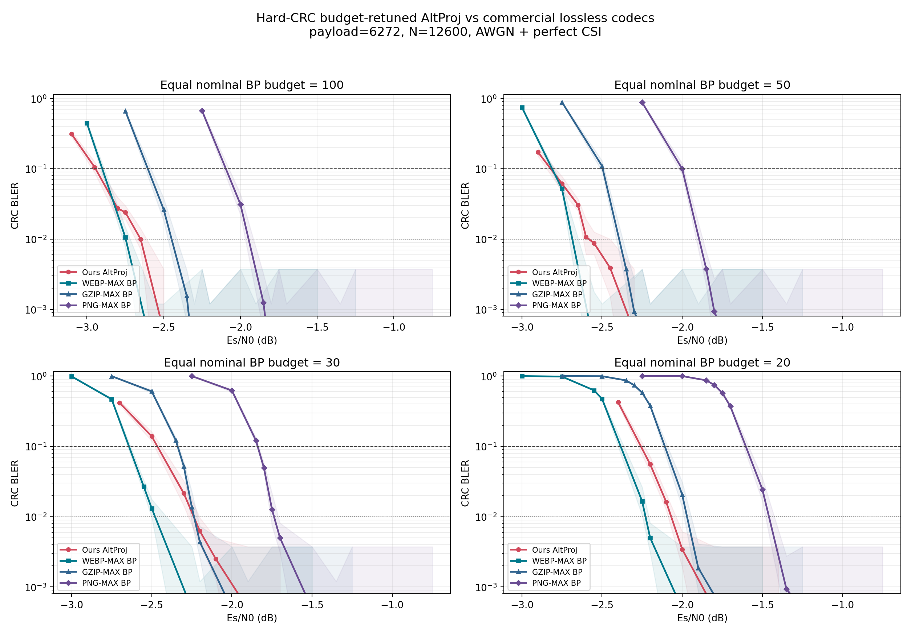

# hard-CRC 재측정: sigma canonical, 3-way, 저예산 codec 대결

## 판정

Sionna `CRCDecoder` 입력을 `logit > 0 -> bit 1` hard decision으로 교정한 뒤
우선순위 1·2를 같은 seed 정책으로 재측정했다.

1. legacy의 geometric sigma `0.3 -> 0.02` 이득은 유지됐다. fixed 대비
   5개 SNR 모두 Wilson 95% CI가 분리됐고 paired 합계는 **3 파괴 / 404 구제**다.
2. 공정 3-way 순위 **altproj > legacy > EP**는 -2.7 dB에서 세 CI가
   분리된 채 유지됐다.
3. 저예산 최적 스킴·주입 강도·BP schedule은 그대로 altproj와 `[5]xN`이다.
   다만 hard-CRC refine에서 sigma endpoint는 모든 예산이 **0.05**로 정리됐다.
4. 상용 codec 상대 판정의 큰 틀도 유지됐다. budget 100/50에서 ours와 WebP가
   교차 또는 사실상 동률이고, budget 30/20에서는 WebP가 우세하다. ours는
   gzip/PNG보다 거의 전 구간 우세하지만 budget 30, BLER `1e-2`에서는 gzip과
   `0.006 dB` 차이의 사실상 동률이다.
5. 후속 작업에서 fixed-latency는 hard CRC로 재생성했다. fading은 아직
   soft-CRC 수치이므로 무효 보류다. 최신 지도는
   [`FIXED_LATENCY_SNR_REPORT_KO.md`](FIXED_LATENCY_SNR_REPORT_KO.md)를 본다.

## 0. Git 선행 작업

다음 세 commit을 `origin/practical_sigma`에 push했다.

- `ddfc677 diagnostics: classify hard-CRC BP20 failures before HARQ`
- `de06dc6 fix: hard-decision CRC checks in experiment diagnostics`
- `35efb98 diagnostics: audit hard-CRC impact and retract syndrome claim`

## 1. sigma schedule waterfall

조건은 legacy `[5]x20`, `alpha=0.1`, `beta=0`, `sigma_post=3.0`,
BPSK/AWGN/perfect CSI다. 같은 payload/noise와 기존 seed를 사용했다.

### 기존 soft-CRC / 신규 hard-CRC

각 셀은 `soft -> hard` BLER다.

| Es/N0 | fixed 0.3 | geom 0.3->0.02 | hard fixed CI | hard geom CI |
|---:|---:|---:|---:|---:|
| -2.8 | .30469 -> .30469 | .15723 -> .15723 | [.27727,.33357] | [.13622,.18080] |
| -2.7 | .17578 -> .17578 | .05371 -> .05273 | [.15369,.20029] | [.04064,.06817] |
| -2.6 | .08105 -> .08008 | .01367 -> .01270 | [.06498,.09831] | [.00743,.02160] |
| -2.5 | .03223 -> .03125 | .00586 -> .00488 | [.02222,.04378] | [.00209,.01138] |
| -2.4 | .00875 -> .00938 | .000625 -> .000625 | [.00657,.01335] | [.00017,.00228] |

hard-CRC fixed 대비 geom의 paired 파괴/구제는 SNR 순서대로
`3/154, 0/126, 0/69, 0/27, 0/28`, 합계 **3/404**다. 기존 soft-CRC의
합계 `3/401`과 실질적으로 같다.

log-BLER 보간 knee는 다음과 같다.

| 목표 BLER | fixed hard | geom hard | 이득 | 기존 soft 이득 |
|---:|---:|---:|---:|---:|
| `1e-1` | -2.628 dB | -2.759 dB | **0.130 dB** | 0.131 dB |
| `1e-2` | -2.405 dB | -2.575 dB | **0.170 dB** | 0.153 dB |

따라서 geom `0.3 -> 0.02`의 canonical 승격은 유지한다.

## 2. legacy / EP / altproj 3-way

공통 `[5]x20`, CRC-ES off, 스킴별 sigma endpoint는
legacy `0.02`, EP `0.05`, altproj `0.02`다. legacy `beta=0`,
EP `beta_ep=1` 규약을 유지했다.

| Es/N0 | scheme | soft-CRC 기존 | hard-CRC 신규 [Wilson 95% CI] |
|---:|---|---:|---:|
| -2.7 | legacy | 58/1024 (.05664) | 57/1024 **.05566** [.04321,.07144] |
| -2.7 | EP | 148/1024 (.14453) | 141/1024 **.13770** [.11794,.16016] |
| -2.7 | altproj | 15/1024 (.01465) | 13/1024 **.01270** [.00743,.02160] |
| -2.5 | legacy | 3/1024 (.00293) | 3/1024 **.00293** [.00100,.00858] |
| -2.5 | EP | 5/1024 (.00488) | 5/1024 **.00488** [.00209,.01138] |
| -2.5 | altproj | 1/1024 (.00098) | 0/1024 **0** [0,.00374] |

-2.7 dB에서 hard-CRC 세 CI는 계속 분리된다. legacy 대비 hard-CRC
파괴/구제는 EP **100/16**, altproj **0/44**다. 기존 soft-CRC는 각각
104/14, 1/44였다. 따라서 순위와 EP의 대량 파괴 해석은 유지된다.

## 3. hard-CRC budget LUT

512-block refine를 budget 100/50/30은 -2.85 dB, budget 20은 포화 회피를
위해 기존과 같이 -2.0 dB에서 수행했다.

| budget | soft-CRC 기존 best | hard-CRC best | hard failures/512 |
|---:|---|---|---:|
| 100 | `[5]x20`, delta=.02, rho=.95, end=.02 | `[5]x20`, delta=.02, rho=.95, **end=.05** | 16 |
| 50 | `[5]x10`, delta=.05, rho=.9, end=.02 | `[5]x10`, delta=.05, rho=.9, **end=.05** | 71 |
| 30 | `[5]x6`, delta=.1, rho=.9, end=.05 | 동일 | 368 |
| 20 | `[5]x4`, delta=.1, rho=.9, end=.02 | `[5]x4`, delta=.1, rho=.9, **end=.05** | 0 |

스킴, chunk 크기, 주입 강도, rho는 모두 유지되고 sigma endpoint만 0.05로
통일됐다. budget 20의 altproj end=.05와 legacy end=.05는 둘 다 0/512라
절대 BLER로는 동률이지만, altproj의 평균 실제 BP iteration이
16.17 대 16.45로 작아 기존 tie-break 규약에 따라 altproj를 유지했다.

## 4. hard-CRC 저예산 상용 codec 대결

1024-block waterfall 뒤 `1e-2` 부근을 3200 block으로 보강했다. 동일 명목
BP budget과 universal hard-CRC early-stop을 모든 arm에 적용했다.

### Knee @ BLER 0.1

괄호는 knee에서 보간한 평균 실제 BP iteration이다. 낮은 Es/N0가 좋다.

| budget | ours | WebP | gzip | PNG | ours-WebP |
|---:|---:|---:|---:|---:|---:|
| 100 | **-2.940** (63.2) | -2.801 (43.1) | -2.529 (44.2) | -2.027 (43.8) | **-0.138 dB** |
| 50 | **-2.802** (36.4) | -2.767 (34.5) | -2.487 (35.3) | -2.000 (36.1) | **-0.035 dB** |
| 30 | -2.434 (23.4) | **-2.583** (24.7) | -2.334 (25.8) | -1.835 (25.9) | +0.149 dB |
| 20 | -2.224 (18.9) | **-2.296** (17.9) | -2.044 (18.3) | -1.543 (18.5) | +0.072 dB |

### Knee @ BLER 0.01

| budget | ours | WebP | gzip | PNG | ours-WebP |
|---:|---:|---:|---:|---:|---:|
| 100 | -2.650 (39.2) | **-2.738** (33.9) | -2.401 (31.1) | -1.894 (30.6) | +0.088 dB |
| 50 | -2.581 (28.0) | **-2.588** (25.8) | -2.359 (27.7) | -1.860 (27.8) | +0.006 dB |
| 30 | -2.225 (19.8) | **-2.440** (21.4) | -2.230 (22.9) | -1.732 (22.9) | +0.216 dB |
| 20 | -2.051 (16.8) | **-2.222** (17.0) | -1.944 (17.0) | -1.408 (16.6) | +0.170 dB |

hard-CRC 교정 후에도 주요 해석은 다음과 같다.

- budget 100: ours/WebP 곡선 교차. `1e-1`에서는 ours +0.138 dB,
  `1e-2`에서는 WebP +0.088 dB.
- budget 50: `1e-1` ours +0.035 dB, `1e-2` 차이 0.006 dB로 사실상 동률.
- budget 30/20: WebP가 두 목표 BLER에서 우세.
- ours는 PNG보다 전 예산에서 크게 우세하다.
- gzip 대비 ours는 대부분 우세하지만 budget 30, `1e-2`의 0.006 dB는
  사실상 동률이다. “전 예산·전 목표에서 gzip을 이김”이라는 기존 문장은
  이 한 점에 대해서는 완화한다.

## 5. soft-CRC 결과 보존과 보류 항목

기존 soft-CRC 수치는 삭제하지 않았다. 원 JSON·PNG와 기존 보고서 본문을
부록/역사 기록으로 유지하되, primary 성능 근거로 사용하지 않는다.

- sigma soft 원자료: `results/denoiser_sigma_beta0_waterfall.json`
- 3-way soft 원자료: `results/denoiser_sigma_fair_5x20_m2p{7,5}.json`
- codec soft 통합: `results/low_budget_codec_duel.{json,png}`
- hard 통합: `results/low_budget_codec_duel_hardcrc.{json,png}`

이 보고서 작성 시점에는 fixed-latency와 fading이 모두 보류였으나, 후속 작업에서
fixed-latency만 hard CRC로 복구했다. 과거 soft 그림은 계속 무효이며 최신 결과는
`results/fixed_latency_snr_summary_hardcrc.json`과
`fixed_latency_snr_hardcrc_lden{20,50,100}.png`다. fading은 여전히 보류한다.

## 6. `syn=0 != 정답` 철회

과거 명제 ~~`syn=0 != 정답`, source가 valid-but-wrong codeword를 판별한다~~는
soft-logit CRC 오용의 artifact로 철회한다. hard-CRC 512-block 재현에서
`syn=0 & hard CRC fail=0`, `syn=0 & payload wrong=0`이었다.

CRC-ES의 정정된 근거는 **hard CRC가 full-graph syndrome zero보다 먼저
통과한 164/512 block을 안전하게 조기 종료하는 신호**라는 점이다. valid-wrong
후보 판별의 증거가 아니다.

## 산출물

- sigma: `results/denoiser_sigma_beta0_waterfall_hardcrc.json`
- 3-way: `results/denoiser_sigma_fair_5x20_m2p{7,5}_hardcrc.json`
- budget refine: `results/low_budget_refined_*_hardcrc_512.json`
- ours waterfall: `results/low_budget_ours_b*_waterfall_hardcrc.json`,
  `results/low_budget_ours_b*_lowbler_3200_hardcrc.json`
- codec waterfall: `results/low_budget_codec_*_1024_hardcrc.json`,
  `results/low_budget_codec_*_lowbler_3200_hardcrc.json`
- 통합 표/그림: `results/low_budget_codec_duel_hardcrc.{json,png}`
