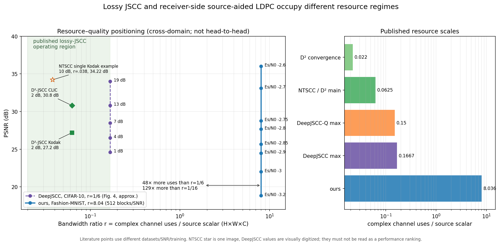

# Lossy JSCC 대비 위치 규명

## 최종 판정

이번 단계에서 D²-JSCC/NTSCC/DeepJSCC와의 **동일 조건 실제 대결(3-C)은 수행하지
않았다.** 실패가 아니라 공정성 분기 결과다.

- 우리 시스템은 Fashion-MNIST의 원본 8비트를 모두 보존한 채 CRC24와 5G LDPC를
  붙여 `12,600` real BPSK use를 쓴다. 두 real dimension을 한 complex use로
  환산하면 bandwidth ratio는 `6,300/784 = 8.0357`이다.
- 대표 lossy JSCC는 대체로 `0.02~0.167` complex use/source scalar에 있다.
  우리 자원은 DeepJSCC `1/6`보다 **48.2배**, D²-JSCC/NTSCC의 `1/16`보다
  **128.6배** 크다.
- D²-JSCC의 공개 저자 구현은 확인하지 못했고, 논문은 16개 rate model을 각
  200 epoch 학습한 뒤 SNR별 retraining까지 요구한다. 공개 NTSCC/DeepJSCC
  구현은 존재하지만 Fashion-MNIST와 `r=8.04`를 정의한 checkpoint/architecture가
  없고 발표 최고 ratio보다 각각 약 129배/48배 높은 overcomplete 영역이다.
- CIFAR-10을 현재 `N=12,600` frame에 raw 8-bit로 넣으면 payload rate가
  `24,576/12,600=1.9505`여서 불가능하다. 같은 자원비를 유지해 `N`을 늘리는
  것은 수학적으로 가능하지만 현재 single-codeword/gray-denoiser 실험을 RGB
  multi-codeblock 시스템으로 새로 만드는 별도 연구가 된다.

따라서 지금 정직하게 말할 수 있는 결론은 **“MSE가 같다고 같은 문제는 아니다”**다.
우리의 positive result는 저SNR에서 lossless stream failure의 왜곡을 줄이는
receiver-side refinement이고, lossy JSCC는 송신단에서 정보를 버려 48~129배
작은 자원으로 perceptual fidelity를 얻는 별도 operating regime다.



이 그림은 논문 figure 후보지만 **성능 순위 그림이 아니다.** dataset, SNR, 학습,
평균/개별 이미지가 다른 점들을 resource–PSNR 평면에 배치해 비교 불가능성 자체를
정량화한다.

## 1. 대표 문헌 조사

`r`은 논문들의 보수적인 공통분모인 `complex channel uses / source scalar
(H×W×C)`로 통일했다. RGB의 spatial pixel당 ratio를 쓰면 수치가 3배 커지므로,
혼동을 막기 위해 아래는 모두 source scalar 기준이다.

| 방법 | 소스 | 자원·변조 | 채널/SNR 정의 | 지표와 대표 수치 | bit-exact/CRC |
|---|---|---|---|---|---|
| **D²-JSCC** (Yuan et al., 2025) | Kodak `768×512×3`, CLIC 최대 `2048×1890×3`; Open Images `256×256` crop 학습; 8-bit RGB | complex-symbol bandwidth ratio `TL/M`; Fig.6 평균 `.022`, Fig.7 `.0625`; practical arm은 length-4096 polar, SNR<3 dB BPSK, 그 외 QPSK | block Rayleigh + channel inversion; complex CSCG noise, symbol power SNR `γ`; Fig.7 | Fig.7, SNR 2 dB: Kodak **27.2 dB**, CLIC **30.8 dB**; Fig.8, SNR 10 dB의 ratio–PSNR | lossy hyperprior bitstream라 원본 bit-exact 아님. channel block error 확률은 모델링하지만 CRC/BLER 성공 규약은 없음 |
| **NTSCC** (Dai et al., 2022) | CIFAR-10 `32×32×3`; Kodak/CLIC; 8-bit RGB, Open Images crop 학습 | `R=k/m`, 두 real latent를 한 complex symbol로 묶음; Fig.10 평균 `R≤1/16` | complex AWGN; paper SNR 10 dB ratio 곡선, SNR sweep은 train=test SNR | Fig.9 PSNR–CBR; Table I에서 BPG+LDPC 대비 BD-PSNR: CIFAR **+2.64**, Kodak **+0.81**, CLIC **+1.31 dB**. Fig.13의 한 Kodak 예: `R=.038`, **34.22 dB** @10 dB | continuous learned latent; CRC와 original-bit BLER 없음 |
| **DeepJSCC** (Bourtsoulatze et al., 2019) | CIFAR-10 `32×32×3`; Kodak `768×512×3`; 24-bit RGB=8 bit/channel, ImageNet crop 학습 | `k` complex symbols for `n=HWC` source scalars; `k/n∈{1/12,1/6}` 중심, continuous complex | `n~CN(0,σ²I)`, `SNR=10log10(P/σ²)`, `P=1` | CIFAR Fig.4 `k/n=1/6`: 시각 판독 약 1/4/7/13/19 dB에서 **24.6/26.5/28.5/30.8/34.0 dB** | bit interface, CRC, BLER 없음 |
| **DeepJSCC-Q** (Tung et al., 2022) | ImageNet `128×128` 8-bit RGB crop 학습, Kodak 24장 평가 | `ρ=k/(HWC)`, Fig.12 약 `.05~.167` complex symbol/scalar; learned/fixed finite constellation, 64-QAM 등 | AWGN 또는 slow Rayleigh; `10log10(|h|²P/σ²)` | Fig.12, SNR 10 dB의 PSNR–ratio; high-order constellation이 unconstrained DeepJSCC에 접근(Fig.7/8) | finite constellation이지만 end-to-end lossy mapping; CRC/original bit-exact 없음 |

출처:

- D²-JSCC: [arXiv 2403.07338](https://arxiv.org/abs/2403.07338), published
  in IEEE JSAC 43(4), 1246–1261, 2025.
- NTSCC: [paper](https://arxiv.org/abs/2112.10961),
  [author implementation](https://github.com/wsxtyrdd/NTSCC_JSAC22).
- DeepJSCC: [paper](https://arxiv.org/abs/1809.01733),
  [public PyTorch implementation](https://github.com/changwoolee/isec-deep-jscc).
- DeepJSCC-Q: [paper](https://arxiv.org/abs/2206.08100).

### D²-JSCC에서 특히 주의할 점

D²-JSCC는 흔히 말하는 analog DeepJSCC와 달리 deep **lossy source coder + digital
polar code + BPSK/QPSK**다. 그 점에서는 우리보다 가까워 보이지만, 송신단에서
이미 rate-distortion 최적화된 lossy bitstream을 생성한다. 원본 8-bit payload를
보존하고 수신기에서만 prior를 추가하는 우리와는 여전히 목적함수가 다르다.
논문의 16개 source model은 bpp `.012~1.36`, 각 200 epoch이고, 선택된 모델을
SNR별로 반복당 10 epoch 재학습한다(A100 40 GB). 단일 공개 checkpoint 비교로
대체할 수 없는 이유다.

## 2. 자원과 SNR 등가 환산

### 2.1 bandwidth ratio

우리 시스템:

```text
payload = 28×28×8 = 6,272 bit
LDPC input = payload + CRC24 = 6,296 bit
transmission = 12,600 real BPSK use
equivalent complex use = 12,600 / 2 = 6,300
r = 6,300 / (28×28×1) = 8.0357 complex use/source scalar
payload rate = 6,272 / 12,600 = 0.49778
LDPC input rate = 6,296 / 12,600 = 0.49968
```

| 기준 | ratio | ours가 쓰는 자원 배수 |
|---|---:|---:|
| D²-JSCC Fig.6 | .022 | 365.3× |
| D²-JSCC Fig.7 / NTSCC SNR sweep | .0625=1/16 | 128.6× |
| DeepJSCC 1/12 | .0833 | 96.4× |
| DeepJSCC 1/6 | .1667 | 48.2× |
| ours | 8.0357 | 1× |

논문에 따라 “pixel”이 spatial RGB pixel인지 개별 color scalar인지 모호할 수 있다.
우리에게 불리한 보수 판정을 위해 `HWC` scalar 분모를 채택했다. spatial pixel
분모로 바꾸면 RGB 문헌 ratio가 3배 커지지만, 그래도 ours는 D²/NTSCC보다
42.9배, DeepJSCC 1/6보다 16.1배 크다.

### 2.2 SNR 축

우리의 실수 BPSK `Es/N0`와 문헌의 complex-symbol `P/σ²`는 그대로 같은 숫자가
아니다. 독립된 두 BPSK real use를 I/Q 한 complex use로 묶으면

```text
SNR_complex = (2 Es) / N0
SNR_complex,dB = Es/N0_dB + 10log10(2) = Es/N0_dB + 3.0103 dB
Eb/N0_dB = Es/N0_dB - 10log10(R·log2 M)
```

따라서 우리 MSE 동작점 `Es/N0=-2.85 dB`는 이 환산에서 complex-symbol SNR
약 `+0.16 dB`, `R=0.49968`, BPSK 기준 `Eb/N0≈+0.16 dB`다. 그림에서는 이
환산을 metadata에 보존했지만, 서로 다른 dataset/model의 SNR 곡선을 직접
겹쳐 우열을 말하지 않았다.

## 3. 실제 비교 가능성 판정

### 3-A. 문헌 도메인을 우리 프레임으로 가져오기 — 불성립

| 도메인 | raw 8-bit payload | `N=12,600` raw rate | rate≤.9 최소 N | 현 rate≈.4997 N | 최소 5G LDPC codeblocks (`k≤8448`) |
|---|---:|---:|---:|---:|---:|
| Fashion-MNIST `28×28×1` | 6,272 | .498 | 6,996 | 12,600 | 1 |
| CIFAR-10 `32×32×3` | 24,576 | 1.951 | 27,334 | 49,232 | 3 |
| 256×256 RGB crop | 1,572,864 | 124.83 | 1,747,654 | 3,147,775 | 187 |
| Kodak `768×512×3` | 9,437,184 | 748.98 | 10,485,787 | 18,886,408 | 1,118 |
| CLIC max `2048×1890×3` | 92,897,280 | 7,372.8 | 103,219,227 | 185,912,648 | 10,997 |

Sionna `LDPC5GEncoder` 자체도 single codeword `k≤8448` 제약이 있다. CIFAR-10은
current rate와 ratio를 유지하면 약 `49.2k` BPSK use와 최소 3개 transport/code
block, RGB score model, multi-block source exchange가 필요하다. N을 키우는 것은
이론적으로 가능하지만 production frame의 단순 확장이 아니다.

grayscale 변환이나 downsample은 payload를 줄일 수 있으나 문헌의 RGB distribution,
texture difficulty, 발표 PSNR을 모두 바꿔 숫자 대조가 무효가 된다. 이 우회는
채택하지 않았다.

### 3-B. 문헌 방법을 Fashion-MNIST로 가져오기 — 공정 비교로 불성립

- **D²-JSCC:** 저자 연결 공개 구현을 arXiv/웹/GitHub에서 찾지 못했다(조사일
  2026-08-04). 16-model LUT + SNR별 재학습을 재구현해야 한다.
- **NTSCC:** 저자 PyTorch 구현과 일부 Open Images MSE checkpoint는 공개돼 있다.
  그러나 paper의 주 영역은 `R≤1/16`, 고정 output dimension 한계도 보고돼 있다.
  Fashion-MNIST `r=8.04`는 발표 영역의 129배로, 단순 latent width 변경이 아니라
  새로운 overcomplete architecture/rate-loss 탐색이다. 논문은 pretrained NTC에서
  시작해 단일 RTX3090에서 약 4일 학습했다고 보고한다.
- **DeepJSCC:** 공개 구현은 CIFAR-10/Open Images와 `1/16~1/6` checkpoint를
  제공한다. Fashion-MNIST adaptation 자체는 가능하지만 `r=8.04`는 최대 발표
  ratio의 48배이며 공정한 상대 튜닝을 하려면 architecture, SNR training, latent
  width를 다시 탐색해야 한다.

즉 “코드가 실행된다”와 “동일 자원에서 상대 방법에 충분한 튜닝 기회를 준다”는
다르다. 후자를 충족하지 못하므로 3-C의 소규모 결과를 만들어 우열처럼 제시하지
않았다.

### 3-D. 비교 불가 시 위치도

`plot_jscc_positioning.py`가 다음을 생성한다.

- `results/jscc_ratio_psnr_positioning.png`
- `results/jscc_positioning_data.json`

ours 수치는 `MSE_FAIRNESS_EXTENSION_KO.md`의 512 paired-block aggregate PSNR이고,
D² 숫자는 논문 본문의 Fig.7 수치, NTSCC는 Fig.13의 **개별 이미지** 예,
DeepJSCC는 Fig.4 시각 판독 근사치다. 이러한 품질 차이를 그림 주석과 JSON에
명시했다. 그 점들을 이어 “누가 더 좋다”고 읽는 것은 금지한다.

## 4. 클래스 경계: related-work 초안

| 축 | ours: receiver-side source-aided 5G LDPC | lossy JSCC / D²-JSCC |
|---|---|---|
| 목적 | 원본 payload bit-exact 복원 우선, 실패 시 distortion 완화 | 주어진 channel use에서 평균 distortion 최소화 |
| source representation | raw 8-bit pixel 그대로 | 학습 encoder가 lossy latent/bitstream 생성 |
| 성공 개념 | CRC24 ACK/NACK, BLER 정의 가능 | 원본 bit-exact가 아니므로 통상 PSNR/MS-SSIM만 존재 |
| HARQ | 기존 CRC/NACK와 직접 연동 | 별도 reliability layer/semantic HARQ 설계 필요 |
| 송신단 변경 | 없음: raw payload + 기존 5G LDPC/CRC | neural source encoder 및 대개 새 mapping/channel interface 필요 |
| 수신단 변경 | 기존 BP에 denoiser/source exchange 추가 | paired learned decoder 필요 |
| 표준 호환성 | 현 5G LDPC·CRC·BPSK 유지 | D²는 polar+BPSK/QPSK로 digital이지만 learned lossy source coder 필요; analog JSCC는 arbitrary complex latent |
| 주 자원 영역 | `r≈8.04`, 8-bit exact payload redundancy 보존 | 대표 `r≈.02~.167`, 송신 전 source information 폐기 |
| 적합 응용 | 의료 원자료, 문서, 계측, archive, 설치된 송신기 업그레이드 | 소비자 영상/semantic delivery, distortion 허용 링크 |

논문용으로는 lossy JSCC를 MSE “baseline” 한 줄에 놓기보다, 다음처럼 문제 클래스를
먼저 분리하는 표현이 안전하다.

> Lossy JSCC buys bandwidth efficiency by changing both endpoints and discarding source
> information before transmission. Our method instead preserves the standardized raw-bit
> interface and CRC semantics, spending substantially more channel uses to enable exact
> recovery while providing graceful reconstruction below the conventional decoding cliff.

## 5. 자율 결정과 다음 단계 권고

1. **3-C 중단 기준:** 공개 구현의 유무만으로 진행하지 않고, 동일 dataset·ratio·SNR과
   상대법 재튜닝 가능성까지 요구했다. D²는 구현/학습, NTSCC/DeepJSCC는 48~129배
   ratio 외삽에서 이 기준을 넘지 못했다.
2. **공정성 우회 기각:** CIFAR grayscale/downsample은 숫자를 만들 수 있지만 문헌
   수치와 비교할 수 없어 채택하지 않았다.
3. **plot의 보수성:** ours에 유리한 Fashion 난이도와 lossy 문헌의 자연영상 난이도를
   섞어 승패를 표시하지 않고, cross-domain positioning이라고 전면 표기했다.
4. **권고:** 이 갈래의 paper claim은 “lossy JSCC보다 높은 PSNR”가 아니라
   **bit-exact/CRC/표준 송신단을 유지하는 graceful receiver refinement**로 고정한다.
   실제 lossy JSCC 대결이 꼭 필요하면 별도 프로젝트로 CIFAR-10 RGB score model,
   약 `N=49.2k` BPSK multi-codeblock frame, NTSCC/DeepJSCC-Q의 동일-ratio retraining을
   함께 설계해야 한다. 현재 논문에는 위치도와 클래스 경계까지만 넣는 것이 맞다.

## 재현

```bash
python plot_jscc_positioning.py
```

production `decoder.py`와 기존 8-bit 통신 경로는 수정하지 않았다.
