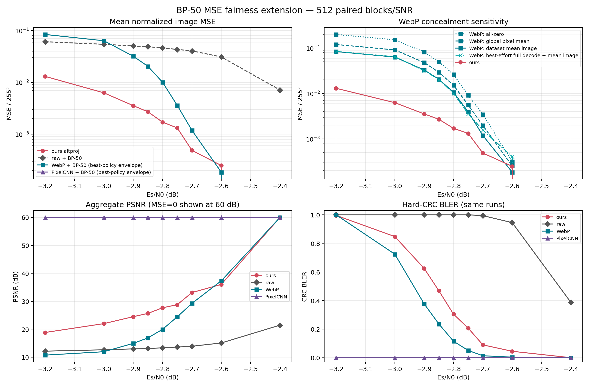

# BP-50 MSE 비교 공정성 확장 — 512 paired blocks/SNR

## 판정

BP를 정확히 50회(`[10]×5`) 사용하고 MSE용 파라미터를 고정한 상태에서,
WebP의 CRC 실패 concealment를 네 가지로 공정화하고 SNR당 512 paired block으로
확대했다. WebP에 가장 유리하도록 **각 SNR에서 네 정책 중 평균 MSE가 가장 낮은
정책을 고르는 lower envelope**를 주 baseline으로 삼았다.

- ours와 WebP envelope의 strict crossover 추정값은 **−2.625 dB**이고 측정
  bracket은 **[−2.7, −2.6] dB**다. −2.7 dB 이하에서는 ours의 point estimate가
  낮고, −2.6 dB에서는 WebP가 낮다.
- −2.85 dB에서 ours는 WebP보다 CRC 실패가 더 많지만
  (`0.4688` 대 `0.2363`), 평균 MSE는 **7.54배 낮다**
  (`0.002712` 대 `0.020451`). 기존 64-block의 4.4배 수치는 이 결과로 대체한다.
- 같은 구조는 −3.0~−2.7 dB에서 반복된다. ours가 더 자주 CRC에 실패하면서도
  WebP보다 평균 MSE가 각각 **10.12, 9.00, 7.54, 5.88, 2.72, 2.44배** 낮다
  (−3.0, −2.9, −2.85, −2.8, −2.75, −2.7 dB).
- **PixelCNN-MAX + BP-50은 −3.2~−2.4 dB 전 구간에서 512/512 exact**여서
  BLER=0, MSE=0이다. 따라서 현재 MSE 갈래는 PixelCNN baseline을 이기지 못한다.
- −2.7 dB에서 ours/WebP 평균 MSE bootstrap 구간이 겹치고, −2.6 dB WebP는
  실패가 2개뿐이다. −2.625 dB는 곡선의 point-estimate interpolation이지
  decision-grade 경계는 아니다.

## 1. 조건과 고정 파라미터

| 항목 | 설정 |
|---|---|
| 채널 | BPSK, AWGN, perfect CSI |
| pairing | 같은 Fashion-MNIST test image index와 같은 unit-noise realization |
| 표본 | SNR당 512 block |
| SNR | −3.2, −3.0, −2.9, −2.85, −2.8, −2.75, −2.7, −2.6, −2.4 dB |
| ours | altproj, `δ=0.05`, `ρ=0.85`, geom `σ: 0.3→0.1`, `sigma_post=3` |
| BP | 정확히 50회, `[10]×5`, early-stop off |
| MSE | hard 8-bit image의 `mean((x_hat-x0)^2)/255^2` |
| PSNR | aggregate `−10 log10(mean normalized MSE)`; MSE=0은 그림에서 60 dB로 표시 |

파라미터는 직전 MSE 소표본에서 고른 값을 그대로 썼으며 재튜닝하지 않았다.
production `decoder.py`는 수정하지 않았다.

## 2. concealment 정책과 기존 수치 정정

직전 `MSE_BUDGET50_ESTIMATE_KO.md`의 WebP 주 수치는 **all-zero가 아니었다**.
깨진 stream도 full-frame WebP decode를 시도하고, 실패하면 그 paired test pool의
평균영상을 쓰는 `best effort + mean fallback`이었다. 다만 test pool로 concealment
통계를 만든 것은 데이터 누출이고, 정책별 민감도와 분포를 충분히 명시하지 않았다.

이번 결과는 수신기가 미리 알 수 있는 Fashion-MNIST **train split만** 사용해 다음을
계산했다.

1. `all_zero`: CRC 실패 block을 0 영상으로 대체.
2. `global_constant`: train split 전체의 단일 평균 픽셀값으로 대체.
3. `dataset_mean_image`: train split의 위치별 평균영상으로 대체.
4. `best_effort_full_decode_then_mean_image`: CRC 실패 stream도 Pillow/libwebp로
   full-frame decode를 한 번 시도하고, 실패하면 train 평균영상으로 대체.

WebP의 주 수치는 매 SNR에서 위 네 정책의 최저 평균 MSE를 택한 lower envelope다.
이는 실제 수신기에서 SNR별 정책을 미리 고정하는 것보다도 WebP에 유리한 oracle
baseline이므로, ours의 우위를 과장하지 않는 가장 보수적인 비교다.

검증 가능한 partial-prefix 복호는 생략했다. Pillow/libwebp API는 VP8L stream의
검증된 마지막 symbol 경계나 부분 raster를 노출하지 않고, entropy-state 오류는
이후 symbol을 비동기화한다. ground truth 없이 “깨진 지점까지 맞는 prefix”를
판별할 수 없어서 임의 구현은 baseline으로서 재현 가능하지 않다. 대신 가능한
baseline-favorable full-frame best effort는 4번 정책으로 실제 측정했다.

PixelCNN arithmetic stream도 독립 restart/checksum 경계가 없어 같은 이유로
검증된 partial-prefix concealment를 적용하지 않았다. 이번 격자에서는 CRC 실패가
전혀 없어 네 concealment 정책이 모두 동일한 MSE=0이므로 이 생략이 결과에 영향을
주지 않는다.

## 3. BLER와 평균 MSE/PSNR

`WebP policy`는 해당 SNR에서 lower envelope를 만든 정책이다. PSNR의 60은
MSE=0을 그림에 표시하기 위한 cap이다.

| Es/N0 | ours BLER | ours MSE [boot 95%] | ours PSNR | raw BLER / MSE | WebP BLER | WebP envelope MSE [boot 95%] | WebP PSNR | WebP policy | PixelCNN BLER / MSE |
|---:|---:|---:|---:|---:|---:|---:|---:|---|---:|
| −3.20 | .9961 | .013071 [.012435,.013675] | 18.84 | 1.000 / .060935 | 1.0000 | .084248 [.081304,.087270] | 10.74 | mean image | 0 / 0 |
| −3.00 | .8477 | .006297 [.005696,.006876] | 22.01 | 1.000 / .054399 | .7246 | .063721 [.059569,.068059] | 11.96 | mean image | 0 / 0 |
| −2.90 | .6250 | .003563 [.003030,.004122] | 24.48 | 1.000 / .050475 | .3770 | .032070 [.028187,.036555] | 14.94 | best effort | 0 / 0 |
| −2.85 | .4688 | .002712 [.002245,.003191] | 25.67 | 1.000 / .048997 | .2363 | .020451 [.016935,.024442] | 16.89 | best effort | 0 / 0 |
| −2.80 | .3047 | .001711 [.001342,.002107] | 27.67 | 1.000 / .046280 | .1152 | .010061 [.007270,.012949] | 19.97 | best effort | 0 / 0 |
| −2.75 | .2070 | .001323 [.000961,.001746] | 28.78 | 1.000 / .043337 | .0508 | .003601 [.002152,.005223] | 24.44 | best effort | 0 / 0 |
| −2.70 | .0898 | .000488 [.000285,.000707] | 33.11 | .9941 / .040615 | .0137 | .001190 [.000393,.002148] | 29.24 | mean image | 0 / 0 |
| −2.60 | .0449 | .000249 [.000088,.000466] | 36.03 | .9453 / .031016 | .0039 | .000185 [0,.000519] | 37.32 | mean image | 0 / 0 |
| −2.40 | 0 | 0 | 60.00 | .3867 / .007149 | 0 | 0 | 60.00 | tie | 0 / 0 |

−2.85 dB에서 raw+BP-50 대비 ours는 평균 MSE를 **18.07배** 낮추고 aggregate
PSNR을 약 **12.57 dB** 높인다. 따라서 source prior의 distortion 이득 자체는
분명하다. 다만 PixelCNN의 더 낮은 source-coded rate가 주는 channel-code 여유는
이 범위에서 그 이득보다 크다.

## 4. 분포: p50/p90/p99

MSE는 소수 대형 오류에 지배되므로 평균만으로 판정하지 않았다. 아래는 SNR별
per-block normalized MSE 분위수다. WebP는 같은 lower-envelope 정책이다.

| Es/N0 | ours p50 | p90 | p99 | WebP p50 | p90 | p99 |
|---:|---:|---:|---:|---:|---:|---:|
| −3.20 | .012323 | .021772 | .033198 | .082543 | .126042 | .192715 |
| −3.00 | .004403 | .015852 | .029768 | .070963 | .119591 | .181375 |
| −2.90 | .000324 | .012509 | .024602 | 0 | .102786 | .160073 |
| −2.85 | 0 | .010066 | .023041 | 0 | .088879 | .159573 |
| −2.80 | 0 | .005654 | .024094 | 0 | .033012 | .138138 |
| −2.75 | 0 | .002926 | .025854 | 0 | 0 | .096327 |
| −2.70 | 0 | 0 | .016248 | 0 | 0 | .061049 |
| −2.60 | 0 | 0 | .007506 | 0 | 0 | 0 |
| −2.40 | 0 | 0 | 0 | 0 | 0 | 0 |

ours와 WebP 모두 성공 block은 exact이므로 p50이나 p90이 0인 구간이 많다.
그러나 WebP는 실패하면 tail이 훨씬 커서 −2.7 dB에서도 p99가 ours보다 3.76배
높다. 이 때문에 **ours는 exact-success 확률(BLER)에서는 지면서 tail distortion을
줄여 평균 MSE에서는 이기는 구간**을 만든다. −2.6 dB에서는 WebP 실패가 2/512로
p99까지 0이 되고 평균 MSE도 ours보다 낮아지며 이 구조가 끝난다.

## 5. crossover와 해석 범위

positive MSE만 사용해 `log(ours_MSE/WebP_MSE)`를 선형 보간하면 lower-envelope
crossover는 **−2.62497 dB**다. 정책별로 보면 train 평균영상에서만 [−2.7,−2.6]
사이에 strict sign change가 관측됐다. all-zero/global-constant/best-effort는
−2.4 dB에서 두 방식이 함께 exact가 되어 접할 뿐, 측정 구간 안에서 WebP가
strict하게 더 낮아지는 역전은 관측되지 않았다. 주 판정은 특정 concealment를
고르는 대신 WebP에 유리한 lower envelope를 사용한다.

이 결과가 지지하는 주장은 제한적이다.

> 저SNR에서 ours는 WebP보다 CRC exact recovery에는 불리하지만, 실패 영상의
> 왜곡을 국소화해 평균 및 p99 MSE를 낮춘다. 이 graceful-reconstruction 우위는
> 약 −2.625 dB 아래에서 관측된다.

lossless stream이 충분히 보호되는 SNR에서는 WebP가 MSE=0으로 수렴하므로 ours가
우위를 유지할 수 없다. PixelCNN-MAX는 이번 전체 격자에서 이미 그 영역에 있다.

## 6. 산출물과 재현

- `mse_budget50_study.py extended-source`: ours와 raw+BP-50 paired 계측
- `mse_budget50_study.py extended-codecs`: WebP/PixelCNN CRC-gated concealment 계측
- `mse_budget50_study.py extended-plot`: lower envelope, crossover, 4-panel plot
- `results/mse_fairness_extended_source_512.json`
- `results/mse_fairness_extended_codecs_512.json`
- `results/mse_fairness_analysis_512.json`
- `results/mse_fairness_waterfall_512.png`

기존 32/64-block 결과와 파라미터 탐색 근거는
[`MSE_BUDGET50_ESTIMATE_KO.md`](MSE_BUDGET50_ESTIMATE_KO.md)에 보존한다. 최종
공정 비교와 crossover에는 본 문서의 512-block 수치를 사용한다.
