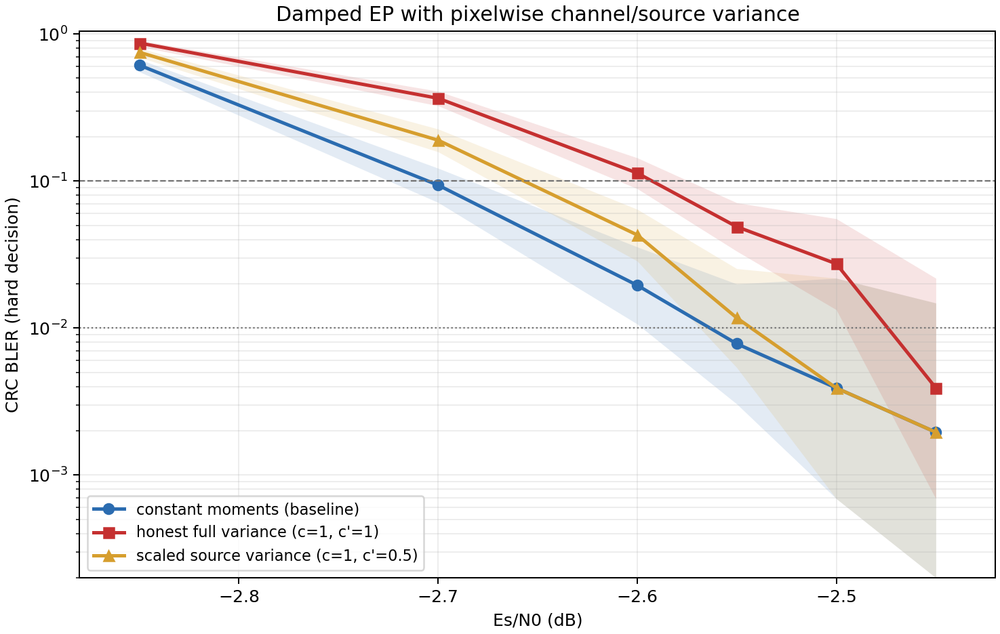

# 단일 단말 EP의 픽셀별 두-site variance 감사

## 판정

**기존 상수 moment가 최종 승자다.** BP에서 계산한 정직한 채널/cavity variance(`c=1`)는 damped EP 한 점에서 분명한 이득을 보였지만, denoiser Jacobian으로 근사한 소스 variance는 정직값과 스케일 조절값 모두 해로웠다. 두 variance를 동시에 넣은 full-diagonal Gaussian EP 근사는 기존 상수 대비 BLER knee가 `10^-1`에서 **0.113 dB**, `10^-2`에서 **0.089 dB** 나빠졌다. 소스 variance를 `c'=0.5`로 조절하면 손실이 각각 0.048/0.021 dB까지 줄지만 이득으로 전환되지는 않았다.

따라서 요청한 세 판정 중 **(c) 기존 상수 최선**이다. 이번 oracle 근사조차 이득이 없으므로 단순한 2차 score/variance head 재학습은 권고하지 않는다.



> 그림의 0-failure 점은 로그축 표시를 위해 `0.5/n`에 놓았고, 음영은 실제 Wilson 95% CI다. knee는 양의 BLER 두 점 사이에서 `log10(BLER)` 선형 보간했다.

## 공통 조건과 구현 경계

- 브랜치: `practical_sigma`
- 채널/자원: BPSK, AWGN, perfect CSI, payload 6,272 bit, `N=12,600`, rate 0.4978
- 복호: damped EP 또는 altproj, `[5]x20`, source call 19회, hard-decision CRC
- EP: `alpha_ep=0.01`, `beta_ep=1`; altproj: `delta=0.02`, `rho=0.95`
- 기준 sigma: denoiser 입력 `0.3 -> 0.05` geometric, `sigma_post=3.0`
- production `decoder.py`, `source_prior.py`는 수정하지 않았다. 실험 wrapper만 사용했다.

채널 variance는 BP posterior LLR에서

`Var[x_j] = sum_b 2^(2b) p_jb(1-p_jb)`, `sigma_cav(j)=c*sqrt(Var[x_j])/255`

로 계산했다. 현재 EDM은 이미지마다 scalar sigma만 받으므로, `{0.001,0.003,0.01,0.03,0.1,0.3}`에서 forward한 출력을 log-sigma 축으로 픽셀별 보간했다. 이는 재학습 없는 spatial-sigma 상한 근사다.

소스 variance는 4-probe deterministic Hutchinson finite difference로 diagonal Tweedie moment

`v_den(j) = sigma(j)^2 * diag(dD/dx)_j`

를 근사했다(`eps=0.02`, 0..255 std clip `[0.5,128]`). 이를 `sigma_post(j)=c' * sqrt(v_den(j))`로 기존 per-pixel readout slot에 넣었다.

따라서 여기서 말하는 “full Gaussian EP”는 **픽셀별 diagonal moment를 모두 쓰는 근사**이지, 픽셀·bit 간 full covariance를 유지하는 정확한 다변량 EP는 아니다.

## [1] 채널 site variance

### Altproj, -2.85 dB, 독립 1,024 block

| 설정 | 실패/블록 | BLER (Wilson 95%) | baseline 대비 파괴/구제 | paired p |
|---|---:|---:|---:|---:|
| 상수 sigma schedule | 65/1024 | 0.0635 [0.0501, 0.0801] | - | - |
| 픽셀 variance, `c=0.5` | 287/1024 | 0.2803 [0.2536, 0.3086] | 224/2 | 4.76e-64 |
| 픽셀 variance, `c=1` | 67/1024 | 0.0654 [0.0519, 0.0823] | 15/13 | 0.851 |

64-block 사전 스크린에서도 `c={0.125,0.25,0.5,1}`의 실패 수가 각각 `60,47,11,4`였고 상수는 3이었다. 즉 `c<1`로 uncertainty를 낮춰 신고할수록 빠르게 붕괴했다. altproj에서는 정직한 `c=1`도 상수와 동률이다.

### Damped EP, -2.85 dB, 독립 1,024 block

| 설정 | 실패/블록 | BLER (Wilson 95%) | baseline 대비 파괴/구제 | paired p |
|---|---:|---:|---:|---:|
| 상수 sigma schedule | 565/1024 | 0.5518 [0.5212, 0.5820] | - | - |
| 픽셀 variance, `c=0.5` | 815/1024 | 0.7959 [0.7701, 0.8195] | 252/2 | 2.24e-72 |
| 픽셀 variance, `c=1` | 487/1024 | **0.4756 [0.4451, 0.5062]** | **13/91** | 1.40e-15 |

여기서는 정직한 채널 variance가 유효했다. `c=1`은 78개 순구제이며 CI도 baseline과 분리된다. 반면 `c=0.5`는 250개 순파괴다. “matched보다 낮게 신고하는 것이 항상 최적”이라는 과거의 전역 sigma 교훈은 이 픽셀별 channel-site 축에는 성립하지 않았다.

`c=1`의 평균 `sigma_cav` 궤적은 source call 1/10/19에서 `0.172/0.117/0.080`이었고, 마지막 분포의 median은 0.0185, p90은 0.242였다. 단일 시간 schedule이 놓치는 큰 공간 이질성이 실제로 존재한다.

## [2] 소스 site oracle variance

### Altproj, -2.85 dB

64-block 스크린에서 `c'={0.25,0.5,1,2}`는 모두 3/64로 상수 3/64와 같았고 `c'=4`는 4/64였다. 그러나 독립 1,024-block 검증에서는 다음처럼 이득이 사라졌다.

| 설정 | 실패/블록 | BLER (Wilson 95%) | 파괴/구제 | paired p |
|---|---:|---:|---:|---:|
| 상수 `sigma_post=3` | 65/1024 | 0.0635 [0.0501, 0.0801] | - | - |
| oracle variance, `c'=0.5` | 92/1024 | 0.0898 [0.0738, 0.1089] | 49/22 | 0.00182 |
| oracle variance, `c'=1` | 78/1024 | 0.0762 [0.0615, 0.0941] | 37/24 | 0.124 |

### Damped EP, -2.85 dB, 독립 1,024 block

| 설정 | 실패/블록 | BLER (Wilson 95%) | 파괴/구제 | paired p |
|---|---:|---:|---:|---:|
| 상수 `sigma_post=3` | 565/1024 | 0.5518 [0.5212, 0.5820] | - | - |
| oracle variance, `c'=0.5` | 710/1024 | 0.6934 [0.6644, 0.7208] | 150/5 | 3.16e-38 |
| oracle variance, `c'=1` | 736/1024 | 0.7188 [0.6904, 0.7454] | 174/3 | 9.65e-48 |

정직한 `c'=1`이 가장 좋다는 가설은 기각됐다. 스케일 조절 `c'=0.5`가 정직값보다 덜 나쁘기는 하지만 상수보다 145개를 순파괴한다.

진단상 source call 1에서 Jacobian diagonal의 91.2%가 floor였고 raw posterior std의 median/p90도 0.5/0.5 gray level이었다. 즉 diagonal Jacobian은 denoiser가 국소적으로 평평한 영역을 “매우 확실함”으로 읽지만, 이 값은 denoiser의 model error와 픽셀 간 correlated error를 포함하지 않는다. 결과적으로 근사 오차를 높은 precision으로 되먹이는 false-confidence 구조가 된다.

## [3] 두 site 동시: full-diagonal Gaussian EP 근사

축별 결과에 따라 조절형은 채널 `c=1`, 소스 `c'=0.5`로 정했다. `c=0.5`는 채널 축에서 붕괴했으므로 두 축을 모두 0.5로 놓는 조합은 최적 스케일 조절이 아니다.

| Es/N0 | 블록 | 상수 BLER [95% CI] | 정직형 `1,1` | 조절형 `1,0.5` |
|---:|---:|---:|---:|---:|
| -2.85 | 256 | 0.6133 [0.5524, 0.6708] | 0.8672 [0.8201, 0.9034] | 0.7500 [0.6935, 0.7991] |
| -2.70 | 512 | 0.0938 [0.0714, 0.1221] | 0.3652 [0.3247, 0.4078] | 0.1895 [0.1579, 0.2257] |
| -2.60 | 512 | 0.0195 [0.0106, 0.0356] | 0.1133 [0.0887, 0.1437] | 0.0430 [0.0285, 0.0642] |
| -2.55 | 512 | 0.0078 [0.0030, 0.0199] | 0.0488 [0.0333, 0.0711] | 0.0117 [0.0054, 0.0253] |
| -2.50 | 256 | 0.0039 [0.0007, 0.0218] | 0.0273 [0.0133, 0.0554] | 0.0039 [0.0007, 0.0218] |
| -2.45 | 256 | 0 [0, 0.0148] | 0.0039 [0.0007, 0.0218] | 0 [0, 0.0148] |

| 버전 | knee @ BLER 0.1 | knee @ BLER 0.01 | 상수 대비 손실 |
|---|---:|---:|---:|
| (c) 기존 상수 | **-2.705 dB** | **-2.563 dB** | 기준 |
| (a) 정직형 `c=c'=1` | -2.593 dB | -2.474 dB | +0.113 / +0.089 dB |
| (b) 조절형 `c=1,c'=0.5` | -2.657 dB | -2.543 dB | +0.048 / +0.021 dB |

정직형은 모든 SNR을 합친 paired 회계에서 **280개 파괴, 0개 구제**였다. 조절형은 **99개 파괴, 1개 구제**였다. 서로 다른 SNR을 합친 값이므로 하나의 BLER 추정치로 쓰지는 않았지만 방향 진단은 명확하다. 특히 -2.70/-2.60/-2.55 dB에서 정직형의 CI는 상수와 분리된다.

채널 variance만 넣은 EP가 91/13 구제/파괴였는데 source variance를 더하자 전 SNR에서 구제가 사실상 사라졌다. 따라서 “variance 일반”의 실패가 아니라 **denoiser source variance의 false confidence가 채널 variance의 이득을 압도한 것**이다.

이 결과는 exact-cavity fragility의 variance 버전을 재현한다. 더 정직한 source precision이 더 좋은 추론을 만들지 않았고, 근사 denoiser의 오류를 정확한 site처럼 누적했다. 실행 중에도 일부 batch에서 EP site-change growth 경고가 관찰됐다.

## [4] 최종 해석과 권고

1. **채널 site:** 정직한 픽셀별 BP variance는 damped EP에 가치가 있다. 다만 altproj에서는 상수와 동률이고, 현 spatial-sigma adapter가 scalar EDM 6회 보간을 요구해 6배 forward 비용이다.
2. **소스 site:** diagonal Tweedie oracle은 상수 `sigma_post=3`보다 못하다. 정직한 값은 특히 위험하고, 스케일 조절은 손실만 줄인다.
3. **두 site:** full-diagonal moment 사용은 이론적으로 더 타이트하지만 실제 BLER은 나빠졌다. 본 시스템에서는 근사 정규화가 정직한 source-site 추론을 이긴다.
4. **2차 score 재학습:** 권고하지 않는다. oracle 근사로도 source variance가 유의한 이득을 못 냈고, 단순 variance head는 누락된 공분산과 model error를 해결하지 못한다. 다시 검토하려면 scalar/diagonal variance head가 아니라 calibrated model-error term 또는 low-rank covariance까지 포함하는 별도 연구가 필요하다.
5. **배제 사슬:** “픽셀별이면 과거 state-based sigma 실패를 피할 수 있다”는 가설은 채널 variance에 한해 부분 성립했지만, source variance와 full 결합에는 성립하지 않았다.

## 연산비와 실행 이슈

- 상수: source call당 denoiser 1회, 전체 19 forward
- 채널 spatial sigma: 6-grid 보간으로 114 forward-equivalent
- 소스 variance: base + 4 Hutchinson probe로 95 forward-equivalent
- 두 site 동시: 6-grid를 base/probe마다 호출해 570 forward-equivalent, 상수 대비 약 30배

장시간 TF/PyTorch 혼합 프로세스가 -2.55 dB 1024-block 실행 도중 두 번 `SystemError`로 중단됐다. 완료된 SNR JSON은 보존하고, -2.55 dB는 정상 완료한 독립 512 block, -2.50/-2.45 dB는 256 block으로 제한했다. 실패한 불완전 실행은 집계에서 제외했다. 이 때문에 낮은 BLER 지점의 CI는 넓으며 knee 차이 0.02~0.05 dB를 확정적 이득/손실로 과장하지 않는다.

## 재현

```bash
python3 site_variance_ep_study.py \
  --scheme ep \
  --candidate const --candidate both:1:1 --candidate both:1:0.5 \
  --snrs -2.85 -2.70 -2.60 \
  --blocks 256 512 512 --batch 16 --seed 20263801 \
  --ep-alpha 0.01 --probes 4 \
  --output results/site_variance_both_waterfall_final.json

python3 analyze_site_variance_ep.py
```

주요 원자료는 `results/site_variance_{cavity_screen64,source_screen64,axes_validate1024,ep_validate1024,both_screen64,both_waterfall_final,both_m255_a512,both_m250_256,both_m245_256}.json`이며, 집계본은 `results/site_variance_ep_summary.json`이다.
