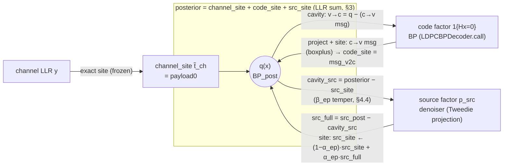

# EP_SYSTEM_BLOCK — corrected system block diagram (EP-aligned decoder)

> **Status**: final deliverable (Task 7). Documents the **as-built** EP-aligned
> decoder (`ep_mode=True`) after Tasks 3–6, and contrasts it with the legacy
> turbo path (`ep_mode=False`, unchanged and preserved).
>
> **Companion docs**: [`EP_THEORY.md`](EP_THEORY.md) (derivation),
> [`EP_MIGRATION_PLAN.md`](EP_MIGRATION_PLAN.md) (the fix),
> [`EP_DIAGNOSTICS.md`](EP_DIAGNOSTICS.md) (convergence/evidence),
> [`EP_APPENDIX.md`](EP_APPENDIX.md) (full probabilistic derivation).
> Section refs "§N" point into `EP_THEORY.md`.
>
> **Reminder**: the goal is EP fidelity, not BLER. Every approximation is named.

---

## 1. Factor graph and the EP message flow

The posterior over the codeword is a product of three factors (§1):

```
p(x | y) ∝ p(y|x) · 1{Hx=0} · p_src(P(x_p))
          └ channel ┘ └ code ┘ └── source ──┘
```

EP keeps one **site** per factor (an exponential-family surrogate); the global
approximation is their product, which in the LLR (natural) parameterization is a
**sum** (§3):

```
        posterior_LLR  =  channel_site  +  code_site  +  src_site
        (payload bits)     t̃_ch (frozen)   t̃_code (BP)   t̃_src (explicit)
```

### 1.1 Block diagram (mermaid)



### 1.2 Block diagram (ASCII, authoritative)

Arrows are labelled with the **EP operation** they carry. `⊘` = cavity
(division = LLR subtraction), `⊗` = combine (product = LLR addition),
`Π` = projection (moment match).

```
                channel LLR  y
                     │  exact site, computed once, FROZEN  (§4.2)
                     ▼
              ┌──────────────┐
              │ channel_site │  t̃_ch = payload0
              └──────┬───────┘
                     │  ⊗  (base of every reconstruction)
                     ▼
        ╔═════════════════════════════════════════════════╗
        ║           posterior  q(x)  =  BP_post            ║
        ║   = channel_site ⊗ code_site ⊗ src_site  (§3)    ║
        ╚═══▲═════════════════▲═══════════════════▲════════╝
            │                 │                   │
   code factor path      (same q)          source factor path
   1{Hx=0}  (§4.3)                          p_src   (§4.1)
            │                                     │
   ┌────────┴─────────┐               ┌───────────┴───────────────┐
   │ (1) cavity ⊘     │               │ (1) cavity ⊘              │
   │  v→c = q − c→v   │               │  cavity_src               │
   │  (per edge)      │               │   = posterior − src_site  │  ◄── the fix
   │                  │               │   (β_ep tempers code, §4.4)│
   │ (2)(3) BP tilted │               │ (2) tilted = cavity·p_src  │
   │  + project:      │               │ (3) project Π = Tweedie    │
   │  boxplus (c→v)   │               │  src_post = D(cavity;σ)    │
   │                  │               │                            │
   │ (4) site:        │               │ (4) site: src_full         │
   │  code_site       │               │   = src_post − cavity_src  │
   │  = msg_v2c       │               │  src_site ←(1−α)·src_site   │
   │  (warm-started)  │               │           + α·src_full      │
   └────────┬─────────┘               └───────────┬───────────────┘
            │  ⊗ back into q                       │  ⊗ back into q
            └───────────► q ◄─────────────────────┘
```

Code anchors for each labelled arrow:

| arrow | operation | code (`decoder.py` unless noted) |
|---|---|---|
| `y → channel_site` | exact frozen site | `channel_site = x1_sys[:, :k_payload]` (`call`) |
| code **cavity/project/site** | sum-product BP | `LDPCBPDecoder.call(...)`; `code_site` = returned `msg_v2c` (§4.3) |
| source **cavity ⊘** | `cavity_src = posterior − src_site` | `cavity_source = channel_site + b_ep*code_added` (`call`) — equals `BP_post − src_site` at β_ep=1 |
| source **project Π** | Tweedie posterior mean | `SoftDenoiser.call` → `SourcePriorDenoiser.forward` → `EDMPrecond.forward` (`D_x = c_skip*x + c_out*F`) |
| source **site** | `src_full = src_post − cavity` | `src_full = self._denoiser(cavity_source)`; `src_site = (1−a_ep)*src_site_old + a_ep*src_full` (`call`) |
| reconstruction ⊗ | `posterior = channel ⊗ src_site` | `payload_intr = channel_site + src_site` (`call`) |
| convergence/evidence | `Z_i`, Δsite | `LDPC5GDecoder_soft._ep_diagnostics` (see `EP_DIAGNOSTICS.md`) |

---

## 2. What each block is, in EP terms

### 2.1 channel factor → `channel_site` (`t̃_ch`)
- **Carries**: the per-bit channel LLR (a Bernoulli natural parameter).
- **Cycle**: degenerate — the factor is already in the exponential family, so
  the projection is exact and the site never changes (§4.2). Computed once as
  `payload0` and **frozen**; it is the always-present base of every posterior
  reconstruction (`payload_intr = channel_site + src_site`).
- **EP status**: exact.

### 2.2 code factor → `code_site` (`t̃_code`) = belief propagation
- **Carries**: the check-to-variable messages (one Bernoulli LLR per graph
  edge), i.e. Sionna's `msg_v2c` state, warm-started across chunks.
- **Cycle**: EP with a fully-factorized family on the parity factor **is exactly
  sum-product BP** (Minka 2001 §4; our §4.3). The variable-to-check message is
  the per-edge cavity `q − (c→v)`, the boxplus check rule is the tilted-project
  step, and the resulting `c→v` message is the site. We do **not** reimplement
  this — `LDPCBPDecoder.call` runs it, fed the prior `channel_site + src_site`.
- **EP status**: exact EP treatment of the code factor.

### 2.3 source factor → `src_site` (`t̃_src`) = score denoiser
- **Carries**: a per-payload-bit Bernoulli LLR (first moment). A pixel-domain
  **precision slot** exists (`SourcePriorDenoiser.projected_pixel_precision`,
  `return_precision=`) but is not yet propagated across chunks — **Approx C**
  (mean-only site).
- **Cycle** (full EP, §4.1):
  1. **cavity** `cavity_src = posterior − src_site` — remove the source's *own*
     previous site (the double-count fix; §2.4 below).
  2. **tilted** `∝ cavity · p_src` — the cavity read as a Gaussian observation
     of the clean image (`SourcePriorDenoiser.llr_to_soft_field`).
  3. **projection** `Π` — Tweedie posterior mean via the EDM denoiser
     (`EDMPrecond.forward`); 2nd moment approximated by a fixed projected pixel
     std (`soft_field_to_posterior_logits`, **Approx C**); σ from the syndrome
     scheduler, not the cavity std (**Approx D**).
  4. **site** `src_full = src_post − cavity_src`, applied as
     `full_ep` (replacement) or `fractional_ep` (damped, §4.4).
- **EP status**: EP-structured; approximations A/C/D/E named (see §5 / appendix).

### 2.4 The scheduling loop
Per outer round (a BP "chunk" then a source update; §5 of the migration plan):
```
refine code factor  (BP inner loop, using current src_site)
        ↓
refine source factor (one denoiser projection on the cavity)
```
channel is refined never (exact). Final chunk is BP-only (decode).

---

## 3. Before / after: where the double-count was removed

### 3.1 Legacy turbo path (`ep_mode=False`, preserved)

```
   channel ──┐
             ▼
   payload_intr ──► [ BP ] ──► BP_post ──────────────┐
        ▲                         │                   │
        │                         ▼                   │
        │                  ┌────────────┐             │
        │      BP_post ───►│  denoiser  │──► src_post │   ◄── denoiser sees the
        │   (FULL posterior)└────────────┘            │       FULL posterior,
        │                                             │       which ALREADY
        │   bp_ext = BP_post − payload_intr           │       contains src_site
        │   src_ext = src_post − BP_post              │       from last round
        └──  new_input = channel + β·bp_ext + α·src_ext ◄─── scaled ADDITION,
                                                              not a site update
```
Two EP violations (§5): the denoiser is fed its **own previous output**
(source **double-count**, [어긋남 1]), and the update is a **damped addition**
onto `channel`, not a site replacement ([어긋남 2]).

### 3.2 EP path (`ep_mode=True`, as built)

```
   channel_site ──┐                              src_site (explicit, warm-started)
                  ▼                                     │
   payload_intr = channel_site + src_site ─► [ BP ] ─► BP_post
        ▲                                                │
        │                          cavity_src = BP_post − src_site   ◄── SELF-MESSAGE
        │                          (β_ep=1; §4.4 tempers code)            REMOVED here
        │                                 │
        │                          ┌────────────┐
        │        cavity_src ──────►│  denoiser  │──► src_post
        │       (source removed)   └────────────┘        │
        │                          src_full = src_post − cavity_src   ◄── full EP site
        │                          src_site ← (1−α_ep)·src_site + α_ep·src_full
        └── payload_intr = channel_site + src_site  ◄── site PRODUCT (⊗), not addition
```

**The single visual difference that fixes the double-count**: the denoiser input
changed from `BP_post` (full posterior) to `cavity_src = BP_post − src_site`
(cavity). Because the denoiser internally returns `src_post − input`
(`SourcePriorDenoiser.compute_source_extrinsic`), feeding it the cavity makes its
output the **exact EP site update** `src_full = src_post − cavity`. See
`EP_MIGRATION_PLAN.md` §3.1 for why this is a one-line conceptual change.

### 3.3 Equivalence & divergence checkpoints (validated)

| condition | legacy vs EP | meaning |
|---|---|---|
| 2-chunk, `full_ep`, α=1,β=0 | **identical** (`max|Δ|=0`) | round 0 has `src_site=0` ⇒ cavity = BP_post; the two coincide (§4.1 anchor). |
| ≥3-chunk, `full_ep` | **diverge** (`max|Δ|≈50+`) | from round 1 the cavity subtracts `src_site` ⇒ the double-count is actually gone. |
| `fractional_ep(α=1,β=1)` | == `full_ep` | damped form reduces to pure replacement. |

(All three are asserted by the Task-3/5 smoke tests.)

---

## 4. Update-law selector (§4.4)

```
ep_update = "full_ep"        →  α_ep = β_ep = 1  →  src_site = src_full        (pure replacement; ALIGNMENT TARGET)
ep_update = "fractional_ep"  →  α_ep, β_ep < 1   →  damped EP (same fixed points; stabilizes the non-linear denoiser)
```
`full_ep` is the default and the alignment target (performance-agnostic).
`fractional_ep` is a stability option; its divergence is auto-detected and
logged (`EP_DIAGNOSTICS.md` §4).

---

## 5. Named approximations (single source of truth)

| tag | where | what is approximated |
|---|---|---|
| **A** | `llr_to_soft_field` | mean-field cavity: only the cavity's 1st moment reaches the pixel domain. |
| **C** | `soft_field_to_posterior_logits` (`sigma_post`) | 2nd-moment std: fixed `sigma_post` (over-confident) on this branch; the diagonal Tweedie `σ²·diag(∂D/∂x̃)` is the drop-in candidate (precision slot ready) — implemented on the sibling branch and shown **insufficient** (correlated, not diagonal). |
| **D** | denoiser `σ` from scheduler | σ is the syndrome-ratio value (proxy for global per-image cavity uncertainty), not the cavity std; diagonal-Tweedie is the drop-in alternative (§A.6.3 trade-off). |
| **E** | `cavity_source = channel_site + β_ep·code_added` | `fractional_ep` tempers the code factor's evidence in the source cavity. |
| **F** | `_ep_diagnostics` `source_logZ` | factorized (per-bit) source normalizer instead of the joint `Z_src`. |
| **damped-EP** | `fractional_ep` | the "fractional" path is damped EP (full-EP fixed points), **not** tempered-factor power EP. |

> **Not an approximation:** the number of inner BP iterations per chunk
> (`bp_schedule`, `bp_convergence`) is a **refinement schedule**, not an
> approximation — each BP step is the EP refinement of the individual check
> factors (`EP_THEORY.md` §4.5–4.6). An earlier draft's "Approx G (truncated code
> projection)" was a misconception and has been removed.

Full statements and their consequences are in
[`EP_APPENDIX.md`](EP_APPENDIX.md) §A.2 and §A.6.
